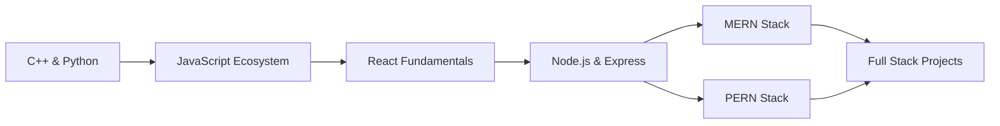

<div align="center">

# 👨‍💻 Bertin Dreyer

### Building the Web with a Systems Mindset

[](https://linkedin.com/in/bertindreyer)
[](mailto:Bertin.Dreyer1@Gmail.com)

</div>

---

## 🎯 About Me

I'm a **Full Stack Developer** who thinks like a computer scientist. While most developers learn frameworks first, I learned to understand what happens *beneath* them—memory management, algorithms, operating systems, and data structures. Now I'm channeling that foundation into building fast, scalable web applications.

**Current Mission:** Mastering the **MERN** and **PERN** stacks to build production-grade apps that don't just work—they *perform*.

---

## 🛠️ Tech Stack

### 🌐 Web Development
```javascript
const currentlyLearning = {
  frontend: ["React", "HTML5", "CSS3", "Tailwind CSS"],
  backend: ["Node.js", "Express.js"],
  databases: {
    sql: "PostgreSQL",
    nosql: "MongoDB"
  },
  stacks: ["MERN", "PERN"]
}
```

### 🎓 Academic Foundation
```cpp
// BSc Computing equipped me with:
class ComputerScientist {
  private:
    - Data Structures & Algorithms
    - Operating Systems Architecture
    - Database Theory & Design
    - Software Engineering Principles
    - Object-Oriented Programming
    - Computational Complexity Analysis
};
```

### 💪 Core Languages


---

## 🚀 What Sets Me Apart
```
┌─────────────────────────────────────────────┐
│  Most Developers    →    Me                 │
├─────────────────────────────────────────────┤
│  "Make it work"     →    "Make it optimal"  │
│  Framework-first    →    Fundamentals-first │
│  Copy-paste         →    Understand deeply  │
│  Surface level      →    Systems thinking   │
└─────────────────────────────────────────────┘
```

My **BSc in Computing** gave me the "why" behind the code:
- ✅ I know *why* MongoDB is schema-less and when that matters
- ✅ I understand database indexing beyond "it makes things faster"
- ✅ I can analyze time complexity and make informed optimization decisions
- ✅ I debug from first principles, not just Stack Overflow

---

## 🌱 Current Learning Journey

**Phase:** Transitioning from academic CS → Production Web Development


**Next Up:**
- 🔨 Building real-world CRUD applications
- 🎨 Mastering React state management and hooks
- 🔐 Implementing authentication & authorization
- ☁️ Deploying to production environments

---

## 📊 GitHub Stats

<div align="center">


</div>

---

## 💡 My Philosophy

> **"The best developers don't just know *how* to code—they understand *why* their code works."**

I bridge the gap between **low-level systems knowledge** and **high-level web development**, writing code that's not just functional, but efficient, maintainable, and scalable.

---

## 📫 Let's Connect

I'm always interested in connecting with fellow developers, especially those who value **fundamentals** as much as frameworks.

- 💼 [LinkedIn](https://linkedin.com/in/bertindreyer)
- 📧 [Bertin.Dreyer1@Gmail.com](mailto:Bertin.Dreyer1@Gmail.com)

---

<div align="center">

**💻 "Building the future, one commit at a time"**


</div>
