<div align="center">

# 👨‍💻 Bertin Dreyer

### Building the Web with a Systems Mindset

[](https://linkedin.com/in/bertindreyer)
[](mailto:Bertin.Dreyer1@Gmail.com)

</div>

---

## 🎯 About Me

I'm a **Full Stack Developer** who thinks like a computer scientist. While most developers learn frameworks first, I learned to understand what happens *beneath* them—memory management, algorithms, operating systems, and data structures. Now I'm channeling that foundation into building fast, scalable web applications.

**Current Mission:** Mastering the **MERN** and **PERN** stacks to build production-grade apps that don't just work—they *perform*.

---

## 🛠️ Tech Stack

### 🌐 Web Development
```javascript
const currentlyLearning = {
  frontend: ["React", "HTML5", "CSS3", "Tailwind CSS"],
  backend: ["Node.js", "Express.js"],
  databases: {
    sql: "PostgreSQL",
    nosql: "MongoDB"
  },
  stacks: ["MERN", "PERN"]
}
```

### 🎓 Academic Foundation
```cpp
// BSc Computing equipped me with:
class ComputerScientist {
  private:
    - Data Structures & Algorithms
    - Operating Systems Architecture
    - Database Theory & Design
    - Software Engineering Principles
    - Object-Oriented Programming
    - Computational Complexity Analysis
};
```

### 💪 Core Languages


### 🧰 Frameworks & Tools


### 🗄️ Databases


---
## 🚀 What Sets Me Apart
```
┌─────────────────────────────────────────────┐
│  Most Developers    →    Me                 │
├─────────────────────────────────────────────┤
│  "Make it work"     →    "Make it optimal"  │
│  Framework-first    →    Fundamentals-first │
│  Copy-paste         →    Understand deeply  │
│  Surface level      →    Systems thinking   │
└─────────────────────────────────────────────┘
```

My **BSc in Computing** gave me the "why" behind the code:
- ✅ I know *why* MongoDB is schema-less and when that matters
- ✅ I understand database indexing beyond "it makes things faster"
- ✅ I can analyze time complexity and make informed optimization decisions
- ✅ I debug from first principles, not just Stack Overflow

---

## 🌱 Current Learning Journey

**Phase:** Transitioning from academic CS → Production Web Development

```mermaid
graph TB
    A[🎓 BSc Computing<br/>UNISA] --> B[📚 Core CS Foundation]
    B --> C[C++ & Python<br/>Systems Programming]
    B --> D[Data Structures<br/>& Algorithms]
    B --> E[Database Theory<br/>& Design]
    
    C --> F[🌐 JavaScript<br/>Ecosystem]
    D --> F
    E --> F
    
    F --> G[⚛️ React.js<br/>Frontend]
    F --> H[🟢 Node.js & Express<br/>Backend]
    
    G --> I[🍃 MERN Stack<br/>MongoDB + React]
    H --> I
    
    G --> J[🐘 PERN Stack<br/>PostgreSQL + React]
    H --> J
    
    I --> K[🚀 Full Stack<br/>Production Apps]
    J --> K
    
    K --> L[☁️ Deploy & Scale]
    
    style A fill:#4A5568,stroke:#2D3748,color:#fff
    style B fill:#2C5282,stroke:#2A4365,color:#fff
    style F fill:#D69E2E,stroke:#B7791F,color:#fff
    style K fill:#38A169,stroke:#2F855A,color:#fff
    style L fill:#805AD5,stroke:#6B46C1,color:#fff
```


**Next Up:**
- 🔨 Building real-world CRUD applications
- 🎨 Mastering React state management and hooks
- 🔐 Implementing authentication & authorization
- ☁️ Deploying to production environments

---

## 📊 GitHub Stats

<div align="center">


[](https://github.com/TpKek)


</div>

---

## 💡 My Philosophy

> **"The best developers don't just know *how* to code—they understand *why* their code works."**

I bridge the gap between **low-level systems knowledge** and **high-level web development**, writing code that's not just functional, but efficient, maintainable, and scalable.

---

<div align="center">

**💻 "Building the future, one line at a time"**

</div>
